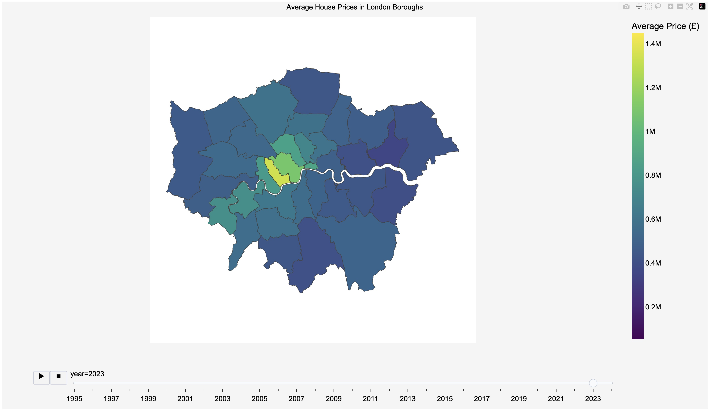

# London House Price Index Visualisation - Boroughs over Time

## Overview

This project analyses and visualises the average house prices in various London boroughs over a range of years. 
Using the London House Price Index dataset, the project provides an interactive visualisation choropleth that shows interactive changes in house prices over time.

## Dataset

The dataset used in this project is the London House Price Index, which contains the monthly average house prices for different boroughs in London. Each row in the dataset represents the average house price for a specific borough in a given month and year.

## Key Columns:

	•	Date: The month and year of the recorded average house price.
	•	Borough Codes: Unique identifiers for each borough.
	•	Average Price: The average house price for each borough.

## Visualisation

The project produces an interactive map of London, where each borough is colored according to its average house price for a specific year. Users can explore:

	•	Hover Information: Detailed information, including the borough name and formatted average price, is displayed when hovering over a borough.
	•	Animation: The map can animate to show changes in average prices by year.
	•	Colour Scale: The colour scale reflects the range of average prices, with options to view different years’ data.

 ## Results

 
